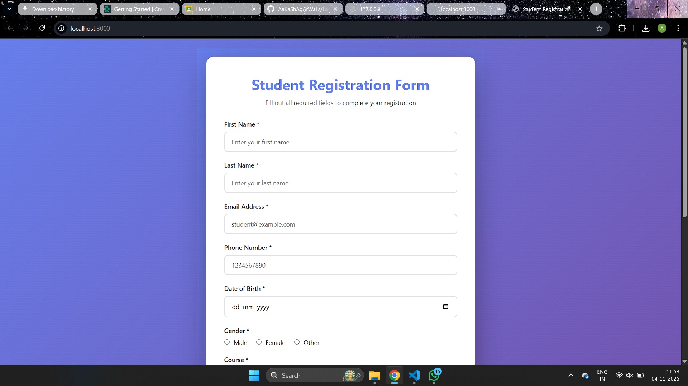
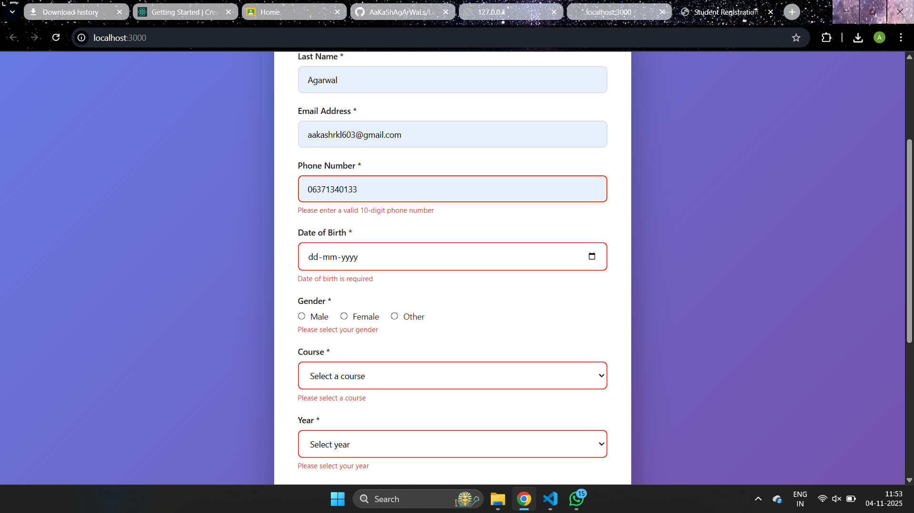
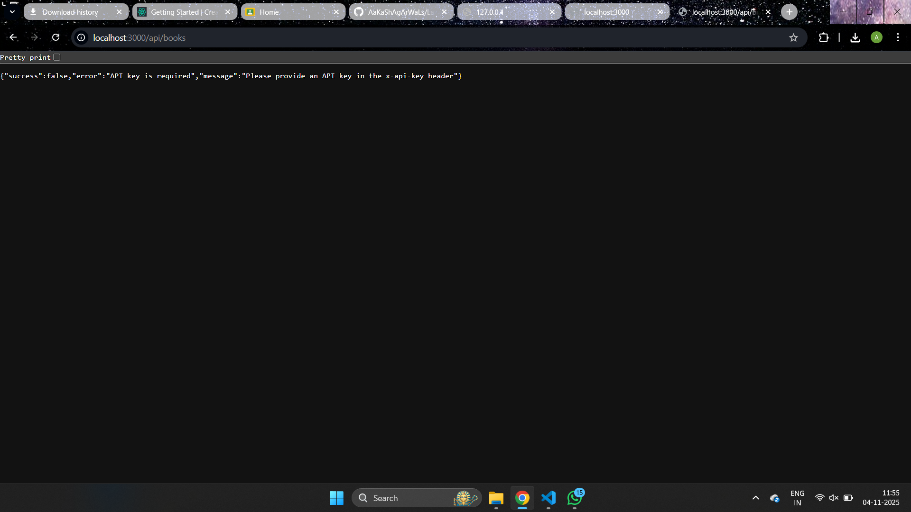

# Lab Exam - Full Stack Applications

This repository contains two complete applications demonstrating React.js frontend and Express.js backend with form handling and API development.

## 📋 Table of Contents
- [Projects Overview](#projects-overview)
- [Question 2: Student Registration Form (React)](#question-2-student-registration-form-react)
- [Question 3: Library Management API (Express)](#question-3-library-management-api-express)
- [Installation & Setup](#installation--setup)
- [Screenshots](#screenshots)
- [Technologies Used](#technologies-used)
- [Features](#features)

---

## 🎯 Projects Overview

### Question 2: Student Registration Form
A comprehensive React application with form validation, multiple input types, and beautiful UI design.

### Question 3: Library Management System API
A RESTful API built with Express.js featuring API key authentication, CRUD operations, and form handling.

---

## 📝 Question 2: Student Registration Form (React)

### Overview
A modern, responsive student registration form built with React featuring comprehensive form validation and an elegant user interface.

### Features
- ✅ **Multiple Input Types**
  - Text inputs (First Name, Last Name)
  - Email validation
  - Phone number validation (10 digits)
  - Date picker (Date of Birth with age validation)
  - Radio buttons (Gender selection)
  - Select dropdowns (Course, Year)
  - Multiple checkboxes (Subject selection)
  - Textarea (Address)
  - Checkbox (Terms & Conditions)

- ✅ **Form Validation**
  - Real-time validation with error messages
  - Required field validation
  - Email format validation
  - Phone number format validation (10 digits)
  - Age validation (16-100 years)
  - Minimum character length checks
  - Subject selection validation (1-6 subjects)

- ✅ **User Experience**
  - Beautiful purple gradient UI
  - Smooth animations and transitions
  - Success page with submitted data display
  - Form reset functionality
  - Error highlighting on invalid fields
  - Responsive design for all devices

### Tech Stack
- React 18.2.0
- React Hooks (useState)
- CSS3 with custom animations
- Modern ES6+ JavaScript

### Project Structure
```
student-registration-react/
├── src/
│   ├── components/
│   │   ├── StudentRegistrationForm.js    # Main form component
│   │   └── StudentRegistrationForm.css   # Component styles
│   ├── App.js                             # Root component
│   ├── App.css                            # App styles
│   ├── index.js                           # Entry point
│   └── index.css                          # Global styles
├── public/
│   └── index.html                         # HTML template
└── package.json                           # Dependencies
```

### Installation & Running

```bash
# Navigate to the project
cd student-registration-react

# Install dependencies
npm install

# Start development server
npm start
```

The application will open at `http://localhost:3000`

### Usage
1. Fill in all required fields (marked with *)
2. Ensure all validation rules are met
3. Select at least one subject (maximum 6)
4. Agree to terms and conditions
5. Click "Register Student"
6. View success page with submitted information

---

## 🔧 Question 3: Library Management API (Express)

### Overview
A comprehensive RESTful API for managing a library system with books, members, and borrowing operations. Secured with API key authentication.

### Features
- ✅ **API Key Authentication**
  - Secure all endpoints with API key validation
  - Header-based authentication
  - Custom error messages for unauthorized access

- ✅ **Books Management**
  - Create, Read, Update, Delete books
  - ISBN uniqueness validation
  - Track available copies
  - Category-based organization

- ✅ **Members Management**
  - Register new members
  - Update member information
  - Email uniqueness validation
  - Track borrowed books per member

- ✅ **Borrowing System**
  - Borrow books with due date tracking
  - Return books with late fee calculation
  - Prevent duplicate borrowing
  - 14-day borrowing period
  - $5 per day late fee calculation

- ✅ **Form Validation**
  - Comprehensive input validation
  - Email format validation
  - Phone number validation (10 digits)
  - Year range validation
  - Custom error messages

### Tech Stack
- Node.js
- Express.js 4.18.2
- In-memory data storage

### API Endpoints

#### Authentication
All `/api/*` endpoints require the following header:
```
x-api-key: LIB-API-KEY-2024-SECRET-12345
```

#### Books
- `GET /api/books` - Get all books
- `GET /api/books/:id` - Get single book
- `POST /api/books` - Add new book
- `PUT /api/books/:id` - Update book
- `DELETE /api/books/:id` - Delete book

#### Members
- `GET /api/members` - Get all members
- `GET /api/members/:id` - Get single member
- `POST /api/members` - Register new member
- `PUT /api/members/:id` - Update member
- `DELETE /api/members/:id` - Delete member

#### Borrowing
- `POST /api/borrow` - Borrow a book
- `POST /api/return` - Return a book
- `GET /api/borrow-records` - Get all borrow records

### Project Structure
```
library-backend/
├── server.js       # Main API server
├── package.json    # Dependencies
└── README.md       # API documentation
```

### Installation & Running

```bash
# Navigate to the backend
cd library-backend

# Install dependencies
npm install

# Start server
npm start
```

Server runs on: `http://localhost:3000`

### Testing with Postman

#### Setup
1. Create a new request in Postman
2. Add header: `x-api-key: LIB-API-KEY-2024-SECRET-12345`
3. Choose request type (GET, POST, PUT, DELETE)
4. Enter endpoint URL

#### Sample Requests

**Add a Book:**
```http
POST http://localhost:3000/api/books
Content-Type: application/json
x-api-key: LIB-API-KEY-2024-SECRET-12345

{
  "title": "The Hobbit",
  "author": "J.R.R. Tolkien",
  "isbn": "978-0-547-92822-7",
  "category": "Fantasy",
  "publishYear": 1937,
  "copies": 5
}
```

**Register a Member:**
```http
POST http://localhost:3000/api/members
Content-Type: application/json
x-api-key: LIB-API-KEY-2024-SECRET-12345

{
  "name": "Alice Johnson",
  "email": "alice@email.com",
  "phone": "5551234567",
  "membershipDate": "2024-11-04"
}
```

**Borrow a Book:**
```http
POST http://localhost:3000/api/borrow
Content-Type: application/json
x-api-key: LIB-API-KEY-2024-SECRET-12345

{
  "memberId": 1,
  "bookId": 2
}
```

**Return a Book:**
```http
POST http://localhost:3000/api/return
Content-Type: application/json
x-api-key: LIB-API-KEY-2024-SECRET-12345

{
  "memberId": 1,
  "bookId": 2
}
```

---

## 🚀 Installation & Setup

### Prerequisites
- Node.js (v14 or higher)
- npm (v6 or higher)
- Git (for cloning)

### Clone Repository
```bash
git clone <your-repository-url>
cd LAB
```

### Install Dependencies

**For React App:**
```bash
cd student-registration-react
npm install
```

**For Backend API:**
```bash
cd ../library-backend
npm install
```

### Run Applications

**Start React App (Terminal 1):**
```bash
cd student-registration-react
npm start
```
Opens at: `http://localhost:3000`

**Start Backend API (Terminal 2):**
```bash
cd library-backend
npm start
```
Runs at: `http://localhost:3000`

> **Note:** If you want to run both simultaneously, change the PORT in `library-backend/server.js` to 3001.

---

## 📸 Screenshots

### Question 2: Student Registration Form

#### Form View

*Beautiful purple gradient design with comprehensive form fields*

#### Validation Errors

*Real-time validation with error messages*

#### Success Page

*Submission confirmation with data summary*

---

### Question 3: Library Management API

#### Postman - API Testing

*API Key authentication header setup*

#### Get All Books

*Retrieving all books from the library*

#### Add New Book

*Creating a new book with validation*

#### Borrow Book

*Borrowing a book with response details*

#### Server Console

*Backend server running with API information*

---

## 🛠 Technologies Used

### Frontend (React)
- React 18.2.0
- React DOM 18.2.0
- React Scripts 5.0.1
- CSS3
- ES6+ JavaScript

### Backend (Express)
- Node.js
- Express.js 4.18.2
- JavaScript (ES6+)

### Development Tools
- npm
- Git
- Postman (API Testing)
- VSCode

---

## ✨ Features Demonstrated

### Form Handling
- ✅ Multiple input types (text, email, date, radio, checkbox, select, textarea)
- ✅ Real-time validation
- ✅ Error handling and display
- ✅ Form submission and reset
- ✅ State management with React hooks

### API Development
- ✅ RESTful API architecture
- ✅ API key authentication
- ✅ CRUD operations
- ✅ Request validation
- ✅ Error handling
- ✅ Form data processing
- ✅ Business logic implementation

### Code Quality
- ✅ Clean, readable code
- ✅ Proper component structure
- ✅ Separation of concerns
- ✅ Comprehensive documentation
- ✅ Best practices followed

---

## 📁 Repository Structure

```
LAB/
├── student-registration-react/      # React Frontend Application
│   ├── src/
│   │   ├── components/
│   │   │   ├── StudentRegistrationForm.js
│   │   │   └── StudentRegistrationForm.css
│   │   ├── App.js
│   │   ├── App.css
│   │   ├── index.js
│   │   └── index.css
│   ├── public/
│   │   └── index.html
│   ├── package.json
│   └── README.md
│
├── library-backend/                 # Express Backend API
│   ├── server.js
│   ├── package.json
│   └── README.md
│
├── screenshots/                     # Application screenshots
│   ├── student-form.png
│   ├── form-validation.png
│   ├── success-page.png
│   ├── postman-header.png
│   ├── get-books.png
│   ├── add-book.png
│   ├── borrow-book.png
│   └── server-console.png
│
├── friend-lab-exam/                 # Alternative implementations
│   ├── employee-survey-react/
│   ├── restaurant-api.js
│   └── README.md
│
├── README.md                        # This file
└── SETUP-GUIDE.md                  # Detailed setup instructions
```

---

## 🎓 Lab Exam Information

**Subject:** Web Development / Full Stack Development
**Topics Covered:**
- React.js (Question 2)
- Express.js (Question 3)
- Form Handling
- API Development
- Authentication
- Validation

**Key Concepts:**
1. React component architecture
2. State management with hooks
3. Form validation techniques
4. RESTful API design
5. HTTP methods (GET, POST, PUT, DELETE)
6. API authentication
7. Error handling
8. Request/Response patterns

---

## 📝 How to Test

### React Application
1. Open `http://localhost:3000` in browser
2. Fill in the form with valid data
3. Try submitting with empty fields (see validation)
4. Try invalid email format (see error)
5. Try invalid phone number (see error)
6. Complete the form and submit
7. View success page

### Express API
1. Open Postman
2. Set header: `x-api-key: LIB-API-KEY-2024-SECRET-12345`
3. Test GET `/api/books` - Should return all books
4. Test POST `/api/books` - Add a new book
5. Test without API key - Should get 401 error
6. Test invalid data - Should get validation errors
7. Test borrowing workflow

---

## 🤝 Contributing

This is a lab exam project. For educational purposes only.

---

## 📄 License

ISC

---

## 👨‍💻 Author

Lab Exam Submission - 2024

---

## 📞 Support

For questions or issues:
1. Check the individual README files in each project folder
2. Review the SETUP-GUIDE.md for detailed instructions
3. Ensure all dependencies are installed correctly
4. Verify Node.js and npm versions

---

## 🎯 Learning Outcomes

After completing this lab exam, you will have demonstrated:
- ✅ Building interactive UIs with React
- ✅ Managing component state
- ✅ Form validation in React
- ✅ Creating RESTful APIs with Express
- ✅ Implementing authentication
- ✅ Handling form data in backend
- ✅ CRUD operations
- ✅ Error handling in full-stack applications
- ✅ API testing with Postman

---

**Lab Exam - Question 2 & 3 Complete** ✅

---

### Quick Start Commands

```bash
# React App
cd student-registration-react && npm install && npm start

# Backend API
cd library-backend && npm install && npm start
```

---

**Happy Coding! 🚀**
